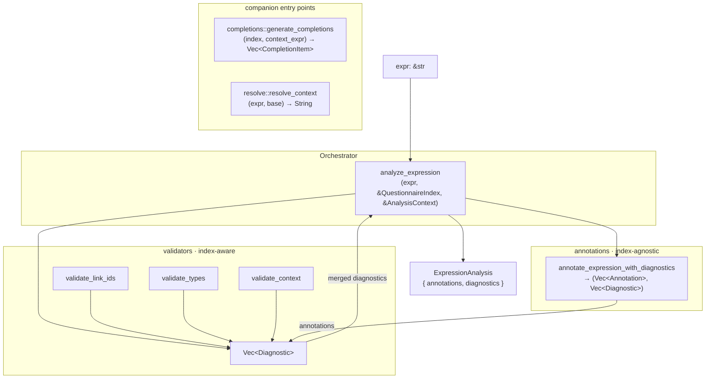
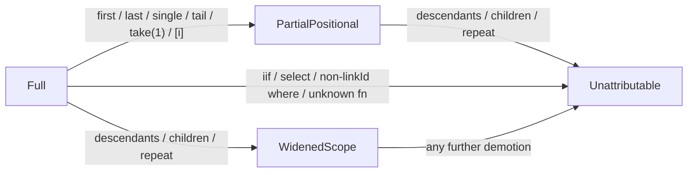

# `analyze` — FHIRPath expression analysis for SDC

Produces semantic annotations and diagnostics for any FHIRPath expression that
runs against a QuestionnaireResponse — `templateExtractContext`,
`templateExtractValue`, `calculatedExpression`, `answerExpression`,
`enableWhenExpression`, `initialExpression`, and friends.

## Architecture



The annotator **never sees the `QuestionnaireIndex`** — it's purely syntactic.
That's the load-bearing split: it lets the state machine be tested in isolation
and keeps it safe to call from contexts without a Questionnaire (tooling,
editors, cross-crate reuse).

## Modules

| Module | Role | Sees index? |
|---|---|---|
| `annotations.rs` | Chain decomposition + state-machine → annotations + `ExpressionNotAttributable` diagnostics | no |
| `questionnaire_index.rs` | Immutable index over a Questionnaire: linkId lookup, type resolution, ancestry, answer-option resolution | — (is the index) |
| `validate_link_ids.rs` | Reparses `where(linkId='…')` literals; flags unknown / unreachable linkIds | yes |
| `validate_types.rs` | Checks the terminal accessor against the item's FHIR type (`.code` on a boolean → error) | yes |
| `validate_context.rs` | `ItemReference`-targets-leaf warnings + parent-context reachability | yes |
| `completions.rs` | Generates completion items given a context expression + index | yes |
| `mod.rs` | Public types (`Annotation`, `Diagnostic`, `Attribution`, …) + `analyze_expression` orchestrator | — |

## Interfaces

### Annotator

```rust
fn annotate_expression(expr: &str) -> Result<Vec<Annotation>, ParseError>;

pub(crate) fn annotate_expression_with_diagnostics(
    expr: &str,
) -> Result<(Vec<Annotation>, Vec<Diagnostic>), ParseError>;
```

- Parses the expression, walks the AST, decomposes each navigation chain into
  `ChainStep`s, runs a state machine, emits annotations + any
  `ExpressionNotAttributable` diagnostics.
- No `QuestionnaireIndex` parameter. Idempotent and pure.

### Validators

All three have the same shape:

```rust
pub(crate) fn validate_*(
    // some combination of:
    expr: &str,                          // for reparsing (link_ids, context)
    annotations: &[Annotation],          // for types and context
    index: &QuestionnaireIndex,
    ..additional context if needed
) -> Vec<Diagnostic>;
```

They **never mutate annotations**; they only read and emit more diagnostics.
Each validator gates on `Attribution`: once an annotation drops to
`WidenedScope` or `Unattributable`, type and reachability checks skip it
because the path is no longer precisely modeled.

### Orchestrator

```rust
pub fn analyze_expression(
    expr: &str,
    index: &QuestionnaireIndex,
    context: &AnalysisContext,
) -> Result<ExpressionAnalysis, ParseError>;
```

Wires annotator + the three validators in a fixed order and merges their
diagnostics. This is the primary public entry point; bindings call it directly.

### Bindings

`crate::bindings::{python, wasm}` are thin adapters. `Annotation` and
`Diagnostic` derive `serde::Serialize` with snake_case variants:

- **WASM** — uses `serde_wasm_bindgen` end-to-end; new variants flow through
  automatically.
- **Python** — converts manually (`PyDict` / `PyList`) so we can preserve
  v3.0.0 dict shapes. Notably: `Attribution::Full` **omits** the
  `attribution` key entirely, so annotations on clean chains stay
  byte-identical to pre-lattice output.

## Attribution lattice

Demotion is monotonic (`Attribution::demote_to`) — a chain never regains
precision.



| Level | Meaning | `validate_types` | `validate_context` reachability |
|---|---|---|---|
| `Full` | Complete set of answers/items for the named linkId(s) | ✔ runs | ✔ runs |
| `PartialPositional` | A positional op narrowed to a subset — linkIds still hold | ✔ runs | ✔ runs |
| `WidenedScope` | `descendants()` / `children()` / `repeat()` broke the parent chain | ✗ skip | ✗ skip |
| `Unattributable` | Opaque op severed precise attribution — linkIds are hints | ✗ skip | ✗ skip |

Annotations with degraded attribution still carry whatever linkIds were
collected upstream of the degrading step; consumers decide whether to trust
them.

## Wire compatibility

Adding a new `Attribution` variant is additive: its serialized form is a new
snake_case string, and `Full` continues to omit the `attribution` key so
v3.0.0 consumers see unchanged dict / JSON shapes on clean chains. Adding a
new `DiagnosticCode` is similarly additive.

## Data flow in one sentence

`expr → AST → chain steps → (anchor, cardinality, attribution, link_ids) →
annotations + diagnostics → validators gate on attribution → merged result`.
